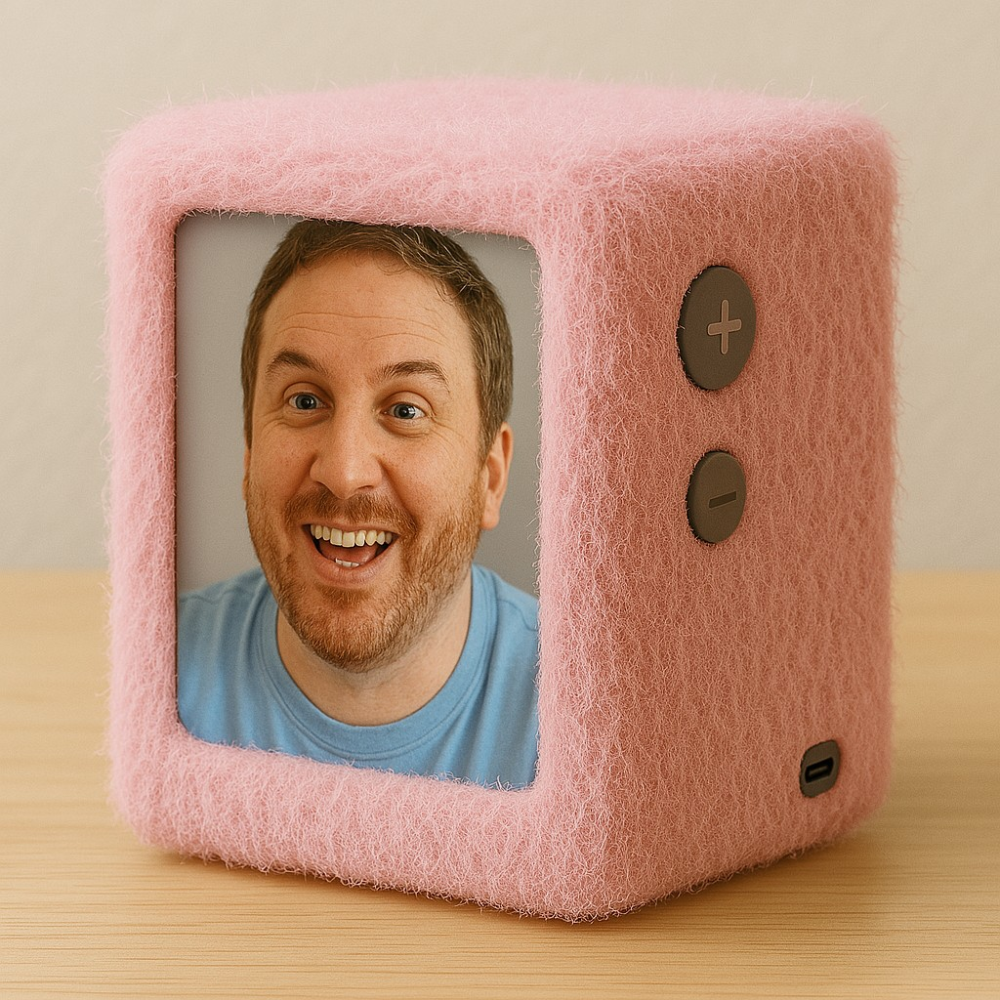

# Ben in a Box (a.k.a. *You in a Box*)

What if remote participation felt more like *being there*?

**Ben in a Box** is an early-stage prototype for a soft, fuzzy, human-face-sized telepresence device. It's designed to help people — especially those of us living with disabilities — attend meetings, conferences, or events in a more engaging, embodied way.

This project is still in its **conceptual and prototyping phase**. The vision is open, collaborative, and community-driven.

---

## Why build this?

Remote access tools often fall short — especially for folks with mobility limitations, fatigue, chronic illness, or sensory issues. 

We deserve more than a black box on mute.

This project began as a personal accessibility tool. But really, it’s about **you**. That’s why the end goal is:  
**You in a Box** — a customizable, open-source presence tool anyone can adapt and build.

---

## What it is (and isn’t — yet)

**Right now**, this is:
- A concept with early mockups and working design schematics
- A 3D-printable housing for Raspberry Pi-based video presence
- A working outline for local captioning (Whisper/Vosk)
- A community project looking for collaborators

**It’s not yet**:
- A plug-and-play product
- A finished software stack
- Fully documented or tested across environments

But that’s where you come in.

---

## What it could become

If there's enough interest, this could evolve into:
- A community-maintained platform for remote presence
- A series of downloadable or purchasable DIY kits
- A space for creative experimentation around avatars, embodiment, and accessibility

We want to make something that *feels good to use* — something soft, personal, and a little weird in the best way.

---

## How it works (conceptually)

- **Hardware**: Raspberry Pi, LCD screen, camera, mic, speaker, soft buttons, USB-C battery, fuzzy fabric
- **Software**: Peer-to-peer video (WebRTC), local speech-to-text (Whisper/Vosk), future overlay UI
- **Design**: Tossable, touchable, transportable. A box with a face.

For a detailed hardware layout, check:
- [`hardware/3d-models/ben-in-a-box-cad-detailed.scad`](hardware/3d-models/ben-in-a-box-cad-detailed.scad)
- [`press/intro-post.md`](press/intro-post.md)

---

## What’s in this repo

- `assets/mockups/`: Visual concepts and generated mockups  
- `hardware/3d-models/`: CAD files (OpenSCAD for now)  
- `software/scripts/`: Early-stage setup script for Raspberry Pi  
- `press/`: Background and intro post for sharing

> Documentation and code are evolving. This is a living repo.

---

## How you can help

We're looking for:
- Feedback on the concept
- Thoughts from disabled and chronically ill folks who might use it
- Hardware suggestions or alternative designs
- WebRTC devs, open source hardware nerds, educators, and accessibility champions
- People who want to help build *You in a Box*

Want to contribute? Open an issue, start a discussion, or fork the repo and share your remix.

---

## Questions we’re asking

- Should this stay Raspberry Pi-based or expand to other platforms?
- Should there be a web controller or mobile pairing app?
- What’s the best way to simplify pairing for non-tech users?
- Could this integrate with avatars or animated faces?
- What would make this feel joyful and comfortable for you?

---

## License

MIT. Free to use, remix, and adapt — especially if you make it softer, weirder, or more inclusive.

---

**If this speaks to you, reach out. Let’s put ourselves in the box — and show up together.**# Ben in a Box

This repo contains the evolving prototype for a soft, smart telepresence device designed to make remote presence more inclusive, joyful, and secure.

## Structure
- `assets/mockups/`: Visual previews and generated designs
- `hardware/3d-models/`: CAD files for 3D printing
- `hardware/schematics/`: Wiring and mounting diagrams
- `software/scripts/`: Raspberry Pi install & automation
- `press/`: Intro post and media-friendly descriptions
